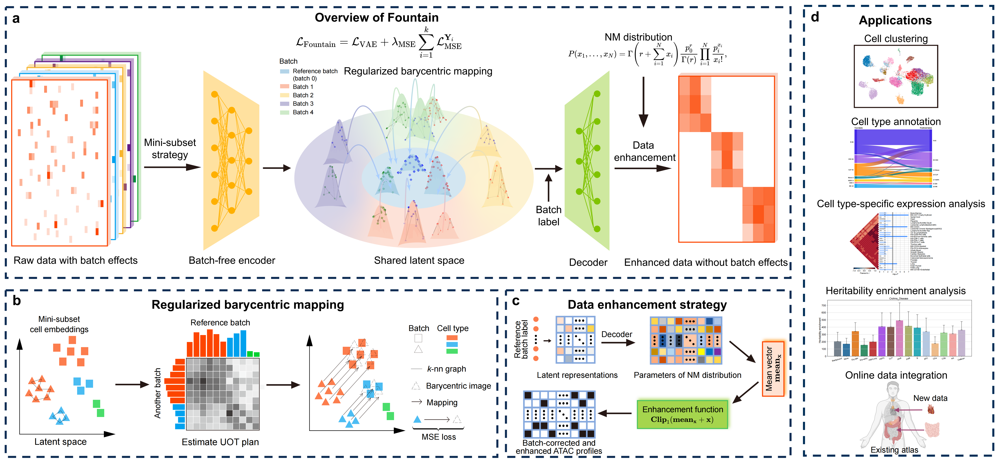

[](https://pypi.org/project/scFountain/) [](https://doi.org/10.5281/zenodo.14924285)

# Rigorous integration of single-cell ATAC-seq data using regularized barycentric mapping


## Package installation

It is recommended to create a new environment for Fountain.

```
conda create -n Fountain python==3.8
conda activate Fountain
```

Fountain is available on [PyPI](https://pypi.org/project/scFountain/) and can be installed using

```
pip install scFountain
```

Installation via Github is also provided


This process will take approximately 2 to 10 minutes, depending on the user's computer device and internet connectivition.

## Tutorial

Usage and examples of Fountain's main functions are shown in [tutorial](https://github.com/BioX-NKU/Fountain/tree/main/Tutorials).


## Quick Start

Fountain is a deep learning framework for batch integration on scATAC-seq data utilizing regularized barycentric mapping. Fountain supports: generating batch-corrected low-dimensional embeddings, generating batch-corrected and enhanced ATAC profiles in the original dimensionality, and online bacth integration. 


### Input format
* **h5ad file**:
	* AnnData object of shape `n_obs` × `n_vars`. 
    
* **count matrix file**:  
	* Rows correspond to peaks and columns to cells.

* **batch label and cell type label**:  
	* The batch label and cell type labels are included in anndata.obs. Cell type labels are used for evaluation, rather than being necessary for training.


### 1. Data preprocessing

  ```python
import scanpy as sc
import episcanpy as epi
import numpy as np
import sklearn
import pandas as pd 
import torch
from Fountain.data import create_dataloader,create_batchind_dict
from Fountain.fountain import Fountain
import scib
import matplotlib.pyplot as plt
  ```
*  You can chick  [MB.h5ad](https://drive.google.com/file/d/1qwKP1xzYVs5rEGRJPU_NJga2Gl0qSTv5/view?usp=sharing) to download the example dataset. 


* First, load and preprocess the raw scATAC-seq count matrix, including binarization and filtering peaks with low counts to reduce noise (typically 1-5% of cells). While stricter filtering improves training time and memory, it may compromise biological signal retention.
  
  ```python
  adata=sc.read("./MB.h5ad")
  fpeak=0.04
  epi.pp.binarize(adata)
  epi.pp.filter_features(adata, min_cells=np.ceil(fpeak*adata.shape[0]))
  ```
  
  
  Anndata object is a Python object/container designed for storing single-cell data in Python packege [**anndata**](https://anndata.readthedocs.io/en/latest/), which is seamlessly integrated with [**scanpy**](https://scanpy.readthedocs.io/en/stable/), a widely-used Python library for single-cell data analysis.

 
### 2. Model training

* Next, initialize the dataloader and define the model architecture.

  
  ```python
  batchind_dict=create_batchind_dict(adata,batch_name='batch')
  batchsize=min(128*len(batchind_dict),1024)
  dataloader=create_dataloader(adata,batch_size=batchsize,batchind_dict=batchind_dict,batch_name='batch',num_worker=4,droplast=False)
  # Define the encoder and decoder architectures. This example uses a three-layer MLP. ['fc', 1024, '', 'gelu'] denotes fully connected layer with output dimmention 1024 and gelu activation.
  enc=[['fc', 1024, '', 'gelu'],['fc', 256, '', 'gelu'],['fc', 16, '', '']]
  # Decoder: Simple single-layer architecture matching input dimension
  # Note: For complex cases (e.g., severe batch effects), consider deeper architectures like: dec = [['fc', 256, '', 'gelu'], ['fc', adata.X.shape[1], '', '']] to enhance the model's capacity to capture batch-specific variations.
  dec=[['fc', adata.X.shape[1], '', '']]

  early_stopping= None   # Early stopping is omitted here for brevity.
  device='cuda:0' # Recommended to run on GPU for better performance
  ```


* Train the Fountain model. The training process is divided into two phases:
  Phase 1 (0 to mid_iteration): Training without batch correction (VAE loss only).
  Phase 2 (mid_iteration to max_iteration): Training with batch correction (VAE loss + MSE loss).
  
  ```python
  model.train(            
            dataloader,             
            lambda_mse=0.005, 
            lambda_Eigenvalue=0.5,
            max_iteration=30000,
            mid_iteration=3000,
            early_stopping=early_stopping,
            device=device, 
        )
  ```
  
  
### 3. Generating batch-corrected low-dimensional embeddings

* After training, one can extract the batch-corrected embeddings as follows.
  
  ```python
  # Get the latent embeddings and store them in adata.obsm
  emb='fountain'
  adata.obsm[emb]=model.get_latent(dataloader,device=device)
  ```
* Visualize the results using UMAP

  ```python
  sc.pp.neighbors(adata, use_rep='fountain')
  sc.tl.umap(adata)
  sc.pl.umap(adata, color=['cell_type','batch'])
  ```

### 4. Generating batch-corrected and enhanced ATAC profiles in the original dimension

* Fountain can also generate corrected and denoised ATAC profiles in the original feature space. For a detailed guide, see [tutorial](https://github.com/BioX-NKU/Fountain/tree/main/Tutorials/Batch%20correction.ipynb). Here is a basic workflow:
  
  ```python
  adata.layers['enhance']=model.enhance(adata,device=device,batch_name='batch')
  ```

### 5. Using Fountain-enhanced ATAC profiles for data analysis

* One can download a Fountain-enhanced example dataset from [enhanced_MB.h5ad](https://drive.google.com/file/d/13nLqv6IC1OzqrgjnRMJ-MvWBFeW6f6Ur/view?usp=drive_link) to explore Fountain's capabilities. This pre-processed dataset is ready for immediate analysis using our [tutorial](https://github.com/BioX-NKU/Fountain/tree/main/Tutorials/Data%20analysis.ipynb).


### 6. Achieving online integration

* One can achieve online integration through the model.get_latent function. Please refer to the [tutorial](https://github.com/BioX-NKU/Fountain/blob/main/Tutorials/Online%20integration.ipynb) for more details.
  
### 7. Extending Fountain to scRNA-seq Batch Correction

* While originally developed for scATAC-seq data, Fountain's flexible architecture makes it also effective for other omics such as  scRNA-seq data. We provide an example [tutorial](https://github.com/BioX-NKU/Fountain/tree/main/Tutorials/Correct%20batch%20effect%20of%20scRNA-seq%20data.ipynb) on applying Fountain to scRNA-seq data. 
